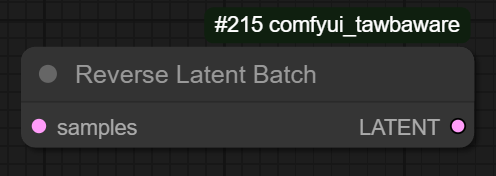
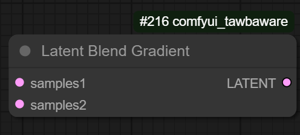
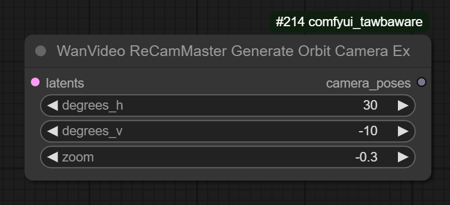

# Miscellaneous Helper Nodes for ComfyUI

## What's here?

This repo contains some custom nodes for [ComfyUI](https://github.com/comfyanonymous/ComfyUI).

## Installation
1. Clone this repo into `custom_nodes` folder.

## Latent Nodes

#### 1. Reverse Latent Batch 

This node reverses the order of the latents in a batch.

#### 2. Latent Blend Gradient

This node blends two batches of latents ("samples1" and "samples2") together using a temporal gradient.  samples1 is weighted more heavily at start, samples2 is weighted more heavily at end.

## Wan Video Nodes

#### 1. WanVideo ReCamMaster Generate Orbit Camera Ex

This is a modified and enhanced version of Kijai's [WanVideoReCamMasterGenerateOrbitCamera custom node](https://github.com/kijai/ComfyUI-WanVideoWrapper), and is designed to be used with Kijai's WanVideoWrapper [ReCamMaster](https://github.com/KwaiVGI/ReCamMaster) related nodes.  This node allows for the creation of arbitrary camera paths by combining an orbit (rotation in the x/y plane around the vertical axis), an elevation change (shift up/down along the z axis) and a zoom (towards or away from subject).

